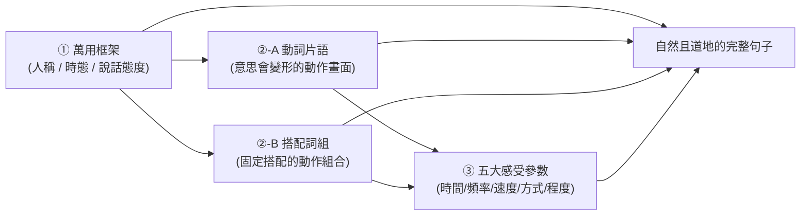

# 大腦樂高口說系統：三大核心積木 (Brain Lego Speaking System)

本文件定義並整理了「大腦樂高口說系統」的設計概念。我們捨棄傳統枯燥的語法分類，改以**認知語言學**與**視覺積木**的角度，將口說組裝化為三大板塊：**「萬用框架」**、**「核心動作積木」**與**「五大感受參數」**。

---

## 🧭 核心概念：三大板塊結構

大腦在口說時，就像是在拼裝樂高積木：

1. **[萬用框架] (Sentence Frames)**：**地基**。定義「是誰、在什麼時間、抱持什麼態度」來說這句話。
2. **[核心動作積木]**：**主體模型**。句子的心臟，分為兩類：
    * **②-A [動詞片語] (Phrasal Verbs)**：動詞＋介係詞，意思會「變形」（come up with ≠ come + up + with），要靠畫面感去記。
    * **②-B [搭配詞組] (Collocations)**：動詞＋名詞的固定搭配，意思比較直覺，重點是「哪個動詞配哪個名詞」（不要用 ~~make a meeting~~，要用 hold/run a meeting）。
3. **[五大感受參數] (Sensory Parameters)**：**環境裝飾**（原稱副詞片語）。都是**局部參數**，修飾單一動詞動作的時間、頻率、速度、進行方式及範圍程度。

---

## 一、 [萬用框架] (Sentence Frames)
這決定了說話者的**立場與開頭方式**。大腦存滿這些框架後，口說就不用臨時去想要用哪個主詞、配什麼時態，直接「套入」即可。

### 1. 行動意圖與準備度 (Intent & Readiness)
*   `I'm about to [原形動詞]...` (我正準備要...)
*   `I was planning to [原形動詞]...` (我本來打算要...)
*   `I'm looking forward to [V-ing/名詞]...` (我非常期待...)
*   `I'm trying to [原形動詞]...` (我正試圖要...)
*   `I'm thinking of [V-ing]...` (我正在考慮...)

### 2. 狀態演變與結果 (Process & Outcomes)
*   `I ended up [V-ing]...` (我最後結果是...)
*   `It turns out that [句子]...` (結果原來是...)
*   `It came down to [V-ing/名詞]...` (事情歸結到最後是...)
*   `Things started to [原形動詞]...` (事情開始...)
*   `It took me a while to [原形動詞]...` (花了我好一些時間才...)

### 3. 語氣與商量 (Politeness & Negotiation)
*   `I was wondering if I could [原形動詞]...` (我在想我是不是可以...)
*   `Would you mind [V-ing]...` (你介不介意...)
*   `You should probably [原形動詞]...` (你可能應該要...)
*   `Do you want me to [原形動詞]...` (你要我...)
*   `I'd rather [原形動詞]...` (我寧願...)

### 4. 認知、猜測與判斷 (Belief & Prediction)
*   `It seems like [句子]...` (看樣子好像...)
*   `There's no way [句子]...` (起碼不可能是...)
*   `I had a feeling that [句子]...` (我有一種...的預感)
*   `It's hard to believe that [句子]...` (很難相信...)
*   `I can't figure out why [句子]...` (我搞不懂為什麼...)

---

## 二-A、 [動詞片語] (Phrasal Verbs)
這是句子的**核心靈魂（動態畫面）**。母語者極少在口說中用正式單字（如 investigate），而是用「動詞＋介係詞」組成的物理軌跡畫面（如 look into）。學法重點：**用動畫／畫面理解組合意義**，因為意思會「變形」。

*   **Look系列**：
    *   `look into` ➔ 視線穿入容器 ➔ **調查/了解** (to check/investigate)
    *   `look down on` ➔ 視線往下看人 ➔ **看扁/輕視** (to think someone is below you)
    *   `look forward to` ➔ 視線越過障礙往前看 ➔ **期待** (to await with pleasure)
*   **Run系列**：
    *   `run into` ➔ 跑著撞進某個空間 ➔ **偶遇/碰上** (to meet by accident)
    *   `run out (of)` ➔ 從容器往外跑光 ➔ **用盡/耗光** (to use up completely)
*   **Bring/Take系列**：
    *   `bring up` ➔ 往上拉拔/提到水面 ➔ **扶養長大/主動提到** (to raise/mention)
    *   `take off` ➔ 啪一聲脫離表面 ➔ **脫掉/起飛/迅速離去** (to remove/leave quickly)
*   **其他常用動作**：
    *   `freak out` ➔ 腦部線路燒毀 ➔ **嚇瘋/崩潰** (to panic/lose control)
    *   `blow up` ➔ 爆炸 ➔ **氣炸/發飆** (to explode/get angry)
    *   `show up` ➔ 從平面浮現 ➔ **現身/露面** (to appear/arrive)

---

## 二-B、 [搭配詞組] (Collocations)
跟動詞片語不同，搭配詞組的意思**比較直覺**，不會「變形」。重點不是理解意思，而是**記住誰配誰** — 母語者就是這樣搭的，換一個動詞就怪怪的。學法重點：**背固定搭配，避免自己亂配**。

### 1. 工作與會議
*   `hold / run a meeting` ➔ 開會（~~make a meeting~~ ✗）
*   `meet a deadline` ➔ 趕上截止日（~~catch a deadline~~ ✗）
*   `take a break` ➔ 休息一下（~~have a rest~~ 可以但不自然）
*   `make a decision` ➔ 做決定（~~do a decision~~ ✗）
*   `give a presentation` ➔ 做簡報（~~make a presentation~~ ✗）

### 2. 問題與解決
*   `come up with a solution` ➔ 想出解決方案
*   `run into a problem` ➔ 碰上問題
*   `keep track of the progress` ➔ 追蹤進度
*   `take action` ➔ 採取行動（~~make action~~ ✗）
*   `make an effort` ➔ 努力（~~do an effort~~ ✗）

### 3. 日常生活
*   `call it a day` ➔ 今天就到這
*   `catch someone's attention` ➔ 吸引某人注意（~~get someone's attention~~ 可以但較弱）
*   `make sense` ➔ 說得通（~~have sense~~ ✗）
*   `take a chance` ➔ 冒個險、試試看
*   `do someone a favor` ➔ 幫某人一個忙（~~make someone a favor~~ ✗）

### 4. 溝通與關係
*   `have a conversation` ➔ 聊天、對話（~~make a conversation~~ ✗）
*   `make a point` ➔ 表達觀點
*   `pay attention` ➔ 注意（~~give attention~~ ✗）
*   `keep in touch` ➔ 保持聯絡
*   `lose one's temper` ➔ 發脾氣（~~lose one's mood~~ ✗）

---

## 三、 [五大感受參數] (Sensory Parameters)
這用來修飾你的動作，帶給聽話者對時間、頻率、速度與方式的**空間立體感受**。都是**局部參數**，修飾單一動詞動作。

### 1. 🕰️ 時間感 (Timeline Placement)
> 大腦畫面：動作在時間軸上相對於「現在」的位置。

| 參數 | 大腦畫面 | 口語在地翻譯 |
| :--- | :--- | :--- |
| `already` | 站在現在，回頭看動作早已越過期待線 | **早就、已經** |
| `yet` | 盯著前方，動作還卡在期待線之前未抵達 | **（否定句）還沒** |
| `still` | 動作像釘子一樣被釘住，持續存在至現在 | **依然、還是** |
| `just` | 動作緊貼著「現在」的左邊，剛好越過 | **剛剛、才剛** |
| `soon` | 時間線前方不遠處有一個點正在逼近 | **很快、馬上** |
| `for good` | 走到某點後，背後的門永遠關上，無回頭路 | **永遠、從此之後** |
| `for now` | 暫時停在目前這個點，不代表永久 | **暫時、先這樣** |
| `from now on` | 站在現在，面向未來一條無限延伸的直線 | **從現在開始** |

### 2. 📊 頻率感 (Frequency Density)
> 大腦畫面：時間軸上格子被動作填滿的密度。

| 參數 | 大腦畫面 | 口語在地翻譯 |
| :--- | :--- | :--- |
| `always` | 100% 覆蓋，時間軸找不到任何空格 | **總是、一直** |
| `never` | 0% 空白，時間軸上空無一物 | **從不、根本沒** |
| `often` | 密度很高，點與點之間非常密集 | **常常** |
| `once in a while` | 絕大多數是空白，好久好久才有一個點 | **偶爾、難得** |
| `from time to time` | 有固定節奏、規律地出現點 | **不時地、有時候** |
| `all the time` | 像沒關的水龍頭，水一直流沒有停過 | **一直、隨時** |
| `every now and then` | 散落的點，不完全隨機但也沒那麼規律 | **三不五時** |

### 3. ⚡ 即時感 (Immediacy & Speed)
> 大腦畫面：事件發生的速度、衝擊性與毫無緩衝。

| 參數 | 大腦畫面 | 口語在地翻譯 |
| :--- | :--- | :--- |
| `right away` | 訊號發出，瞬間衝出，中間沒有任何阻礙線 | **立刻、馬上** |
| `all of a sudden` | 本來一條平線，突然垂直炸開 | **突然間、一下子** |
| `out of nowhere` | 眼前空無一物，啪一聲憑空出現 | **不知從哪冒出來的** |
| `in no time` | 時間線上的這段距離被壓縮到看不見 | **一下子、很快地** |
| `on the spot` | 事情發生的那個坐標點，直接在上面解決 | **當場、立馬** |

### 4. 🎯 方式感 (Manner & Execution Style)
> 大腦畫面：動作的推進軌跡、形狀或結構。

| 參數 | 大腦畫面 | 口語在地翻譯 |
| :--- | :--- | :--- |
| `on purpose` | 有意識地瞄準目標，拉出一條直線箭頭 | **故意的** |
| `by accident` | 走著走著突然一滑偏離軌道，非預期碰撞 | **不小心的、意外地** |
| `little by little` | 細沙般的微小顆粒，一點一點堆高 | **漸漸地、一點一滴** |
| `one by one` | 東西排成一縱隊，依序被處理掉 | **一個接一個** |
| `from scratch` | 從完全空白的畫布開始，從無到有一筆筆畫 | **從零開始、白手起家** |
| `in a row` | 一串連續的方塊，緊密靠在一起沒有空隙 | **連續地** |
| `all the way` | 一條路走到底，中途沒有任何下車或中斷點 | **一路、大老遠** |
| `by yourself` | 畫面中只有你一個人，四周都是空的 | **靠你自己、獨自** |

### 5. 📈 程度感 (Degree & Scale)
> 大腦畫面：量表上的高度、深度或範圍。

| 參數 | 大腦畫面 | 口語在地翻譯 |
| :--- | :--- | :--- |
| `more or less` | 在標準值上下波動的小幅模糊範圍 | **差不多、或多或少** |
| `at least` | 指著刻度表上的底線，低於這條線就不行 | **至少、起碼** |
| `at all` | 空的量表，完全是零，找不到半格痕跡 | **（否定句）一點也(不)** |

---

## 🛠️ 三大積木拼裝實驗室

讓我們試著用這個系統來描述各種口說情境，你會發現所有生活場景都逃不過這三個積木：

### 情境 1：跟朋友抱怨工作累壞了
*   `[萬用框架]`：`I ended up...` (我最後結果是)
*   `[動詞片語]`：`wearing out` (累癱)
    *   *註：因為 ended up 接 V-ing，所以 wear out 變 wearing out*
*   `[感受參數]`（即時感）：`in no time` (一下子)
*   **成品：** "I ended up **wearing out** **in no time**." (我最後一下子就累癱了。)

### 情境 2：跟老闆報告某項調查
*   `[萬用框架]`：`I was planning to...` (我本來打算...)
*   `[動詞片語]`：`look into` (調查) ➔ 原形動詞接頭
*   `[感受參數]`（時間感）：`for now` (暫時先)
*   **成品：** "I was planning to **look into** it **for now**." (我本來打算暫時先去調查這件事的。)

### 情境 3：用搭配詞組處理工作場景
*   `[萬用框架]`：`I'm trying to...` (我正試圖要...)
*   `[搭配詞組]`：`meet the deadline` (趕上截止日) ➔ 原形動詞接頭
*   `[感受參數]`（程度感）：`at least` (至少)
*   **成品：** "I'm trying to **meet the deadline**, **at least** for this round." (我正試圖至少趕上這一輪的截止日。)

---

## 🚀 未來擴充方向 (React App Integration)

在未來的程式碼設計中，我們可以依此框架設計出 **「口說樂高拼裝機 (Speaking Lego Builder)」** 元件：
1. **第一格**：下拉選擇 `[萬用框架]`（決定動詞接頭為原形、V-ing、或過去式）。
2. **第二格**：選擇 `[動詞片語]` 或 `[搭配詞組]`（依第一格接頭自動變形，如 `look into` / `looking into`）。
    * 動詞片語 ➔ 播放「意思變形」的物理軌跡動畫
    * 搭配詞組 ➔ 顯示正確搭配 + 常見錯誤對比（~~make a meeting~~ → hold a meeting）
3. **第三格**：選擇 `[五大感受參數]`（如 `right away`, `by myself`，若是 `by yourself` 且主詞是 `I`，則代碼自動判斷轉換為 `myself`）。
4. **引擎功能**：點擊「發聲/動畫」，動畫引擎便會依照組合，依序播起 **[主詞/框架動畫] ➔ [核心動作動畫] ➔ [環境感受動畫]**，實現完美的視覺化英語學習體驗！
